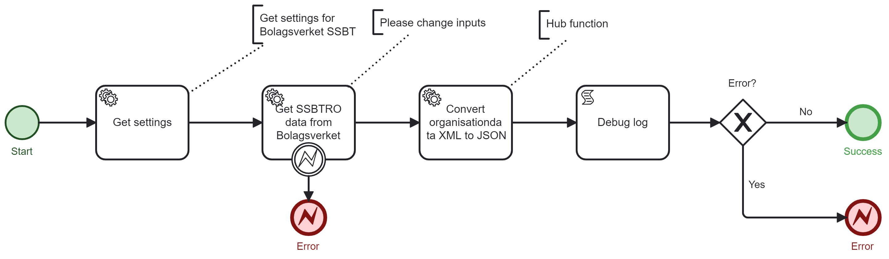

[](https://www.repostatus.org/#wip)


# Onify Blueprint: Get SSBTRO data Bolagsverket

Bolagsverket's [SSBT (Sammansatt bastjänst) service](https://bolagsverket.se/omoss/utvecklingavdigitalatjanster/densammansattabastjanstenforgrundlaggandeuppgifteromforetag/saharfungerardensammansattabastjansten.2229.html) was created with the aim to streamline companies reporting to the government and reducing their administrative burden. SSBT delivers consolidated company information based on source data from Bolagsverket, Skatteverket, and SCB.

> Note: SSBT is an information service only for public actors based in Sweden, that is to say, authorities, municipalities, and regions. 

This blueprint primarily demonstrates how to retrieve which roles a certain person has in a specified company via SSBTRO.

> Note: This has only been tested against SSBTRO testversion  using Bolagsverket fixed test scenarios, see [connection guide (swedish)](https://bolagsverket.se/download/18.46f4138717c599ee403ab292/1688449960663/anslutningsanvisning-for-atkomst-till-ssbt.pdf) and [checklist (swedish)](https://bolagsverket.se/download/18.46f4138717c599ee403ab290/1638951612751/checklista-for-test-vid-anvandning-av-ssbt.pdf) for more information.



## Requirements

These are the technical requirements.

* [Onify Hub](https://github.com/onify/install)
* [Onify Hub Functions](https://github.com/onify/hub-functions)
* [Camunda Modeler](https://camunda.com/download/modeler/)
* Certificate via TeliaSonera (root certificate)
* Firewall opening (external ip allowed by Bolagsverket in their firewall) 

## Setup

### Bolagsverket

As mentioned in the requirements, you need a certificate from TeliaSonera. Here is how you prepare the certificate for use against test service (SSBTRO TEST).

**Download and prepare certificate for Onify**

Go to https://repository.trust.teliasonera.com/teliasonerarootcav1.cer and download the certificate.

Now when you have downloaded (replace `<path_to_teliasonerarootcav1.cer>` below) the certificate you need to convert it to base64 format so it can be used as a setting in Onify. Here is how you do it with powershell:

```powershell
$cerContent = Get-Content -Path "path_to_teliasonerarootcav1.cer" -AsByteStream
$base64Content = [System.Convert]::ToBase64String($cerContent)

$pemContent = "-----BEGIN CERTIFICATE-----`n"
$pemContent += ($base64Content -split '(.{64})' | Where-Object { $_ }) -join "`n"
$pemContent += "`n-----END CERTIFICATE-----"

$certObject = [PSCustomObject]@{
    certificate = $pemContent
}

$jsonContent = $certObject | ConvertTo-Json
$jsonContent
```

> Note: Keep the json for for later...

### Onify

Add the following settings in Onify:

|Key|Value|Type|Tag|Role|
|---|-----|----|---|----|
|bolagsverket_ssbt_certificate_authority|`{certificate": "-----BEGIN CERTIFICATE-----\nMIIFODCCAyC.....}` (the json output from the powershell snippet above)|object|ssbt, bolagsverket|admin|
|bolagsverket_ssbtro_url|`https://ssbtgu-accept2.bolagsverket.se/ssbtro-dft-web/SsbtServicePorts/Test/SsbtRoTestService?wsdl` - URL to SSBTRO service|string|ssbt, bolagsverket|admin

> Note: Create settings via admin interface and add a leading `_` in key. This is required for flow to work.

## Test

1. Open the BPMN diagram in Camunda Modeler.
2. Deploy the BPMN diagram (click `Deploy current diagram` and follow the steps).
3. Run it (click `Start current diagram`).

## Support

* Community/forum: https://support.onify.co/discuss
* Documentation: https://support.onify.co/docs
* Support and SLA: https://support.onify.co/docs/get-support

## License

This project is licensed under the MIT License - see the [LICENSE](LICENSE) file for details.
